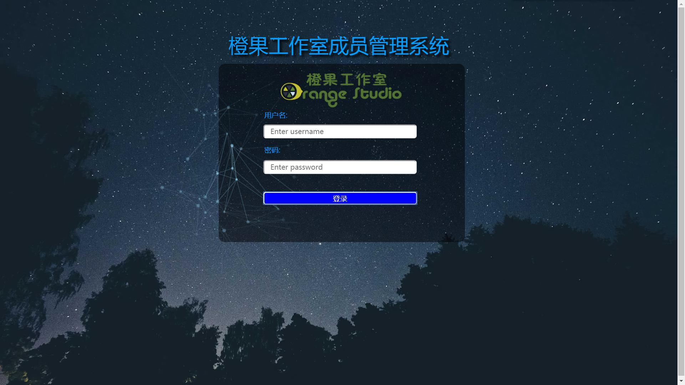

# ①探究一下每个html css js文件可能是用来干什么的，看注释掉某些组件后它是否还能正常运行？看它的运行情况会发生怎样的改变？如果尝试更改动画的颜色要改动什么代码？
(1)index.html是主页，把css js文件链接进来。且有一个canvas标签。这个标签就是实现的是动画效果。
component.css注释掉的话整个背景图片都没有了，normalize注释掉的话网页会有白边。
TweenLite.min.js和EasePack.min.js注释掉的话动画没法根据鼠标移动而动了，成为了静态的，大概是令线条产生动作的作用。而demo-1.js注释掉静态动画也没有了，大概是构成线条的作用。
<br>
(2)改动颜色的话，demo-1.js下175行，有个rgb形式的颜色，可以更改线段点的颜色，156行，可以更改线段的颜色。如图所示：

# ②自行查阅资料，了解为什么有些js和css代码会放弃可读性而全部压缩成一行，这样做是为了什么？
答：是为了减少所占内存。
# ③尝试将上次登录界面的背景替换为这个背景，在替换过程中需要注意什么？
需要注意的点：
我是把需要连接的css与js在之前写的页面中链接一下。
```html
	<div id="large-header" class="large-header">
		<canvas id="demo-canvas" width="1920" height="1080"></canvas>
	</div>
```
外面这个div控制背景图片，我把它写在了原网页从外面数第二个div，这也就改好了背景图片，然后把canvas剪切出来，单独开了一个div放到了最上面，body下面第一行。
但是这会导致动画在上面，页面在下面，然后用定位把他们和在了一起，下面的各种div又把动画给挡住了，通过查资料，知道了z-index：xxx；
这个属性后面的值越大这个标签就约在上层，我觉得就跟图层差不多，需要给这个标签绝对定位才可以用。就给这个动画所在的div加了绝对定位，然后top：0；。
动画就显示在了最上面一次，但是由于遮住了input，没法操作。再给三个input加上绝对定位和z-inde也不管用，我觉得可能是他们的外面有很多层div导致，然后我把input单独拿出来写到最后，
用绝对定位修改，这下问题都解决了。
